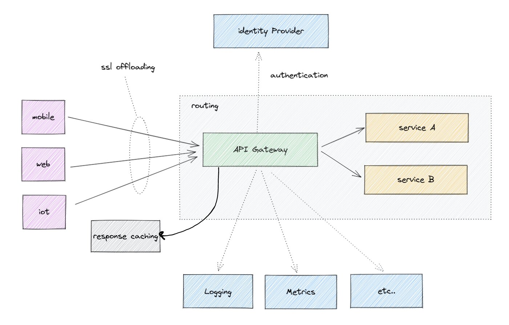

In a microservices architecture, there are multiple types of frontend clients communicating with backend services. These clients could include mobile applications, web applications, or third-party applications. The back end may be composed of many different services exposed over various protocols (SOAP+XML, REST+HTTP, JMS, AMQP, WebSocket, etc.). Clients may collect data from multiple services. In some cases, these services may come from legacy applications, and each application may have its own way of handling security.

Questions arise. How do we minimize the number of client requests to the backend? How do we secure requests for services that may have been originally designed for a different type of client?

### API Gateway Pattern

In many microservices implementations public services are exposed to clients through an API gateway. Internal microservice endpoints are not exposed to external clients, instead they are kept private. There are a number of reasons for this approach:

* Only a select set of microservices are required by clients
* It is difficult to implement client-specific transformations at the service endpoint
* To avoid multiple client calls in a bandwidth-restricted environment, a gateway can perform data aggregation on behalf of the client
* The number of service instances and their locations may change dynamically

The API gateway offers client-specific APIs (e.g. mobile, tablet, etc.) with protocol translation between a web-friendly client frontend and backend services, such as a message queue or database, with a single point of entry (and control) into the set of exposed services. In other words, the client communicates with one or more API gateways that broker services for the client, rather than communicating directly with the services.

### Value of API Gateways

* Clients are isolated from the partitioning of the microservice architecture behind the gateway
* Clients do not have to know the locations of specific services
* If there are client-specific policies to be applied, it is easy to apply them in a single place rather than in multiple places
* The optimal API is provided for each client
* The number of requests/round-trips is reduced
* It simplifies the client implementation by moving the aggregation logic into the API gateway
* Allows centralization of cross-cutting concerns