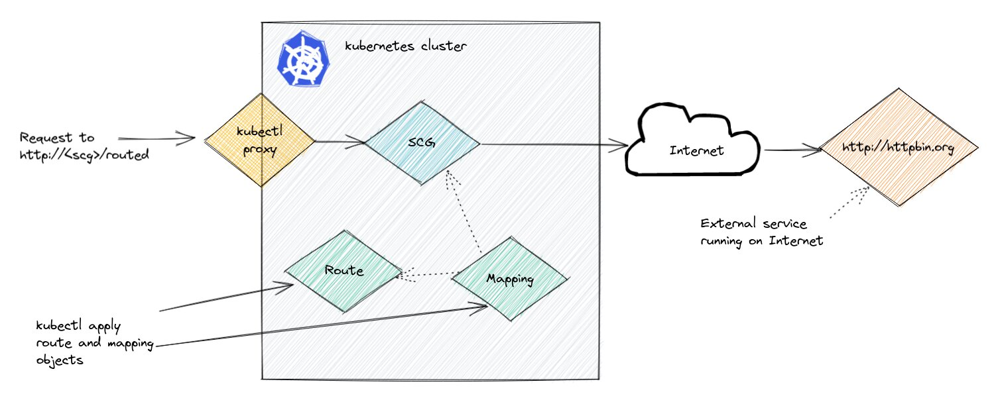

In order to configure SCG to manage a microservice or API, we have to tell it what routes to manage. We do that by creating a route and then mapping that route to a particular Spring Cloud Gateway. Once the route and mapping are configured, the particular SCG instance will then direct requests to those routes to a particular service, and also apply configured filters and such to the routes.

In this section we'll add a route and mapping to the existing gateway. That route will be configured to send traffic directed at sct/routed to httpbin.org.



### Create a Route

Inspect the file demo/route-config.yaml it contains gateway configuration CRD that proxies requests set the gateway to github. Notice that this route configuration is generic.

```editor:open-file
file: ~/demo/route-config.yaml
```

Apply that manifest.

```execute-1
kubectl apply -f demo/route-config.yaml
```

Check the status.

```execute-1
kubectl get springcloudgatewayrouteconfigs
```

Now let's map that route to a gateway.

### Map a Route to a Gateway

Inspect the file demo/mapping.yaml notice that it points at the gateway instance we already deployed at the configuration defined in route-config.yaml

```editor:open-file
file: ~/demo/mapping.yaml
```

Apply that manifest.

```execute-1
kubectl apply -f demo/mapping.yaml
```

At this point we should also have some services available.

```execute-1
kubectl get svc
```

Check the mapping.

```execute-1
kubectl get springcloudgatewaymappings
```

### Test the Route, Mapping and Gateway

We can port forward to the my-gateway service to access the gateway locally.

```execute-2
kubectl port-forward service/my-gateway 8080:80
```

Now we can start to connect to the gateway instance which will route to the external service configured in the route.

First, let's try something that will fail.

```execute-1
curl localhost:8080/get | jq
```

That should fail with a 404, which makes sense because the gateway doesn't have a route for "/get".

Next, let's use "/routed" which according to the rule should send the request to the convenient external service httpbin.org.

Below I'm setting the headers "hello:world" and httpbin will return those same headers in the response.

```execute-1
curl localhost:8080/routed/get -H "hello: world" | jq
```

Note how the response should include the added headers.

Example output (some output removed for brevity):

```
$ curl localhost:8080/routed/get -H "hello: world"
SNIP
    "Forwarded": "proto=http;host=\"localhost:8080\";for=\"127.0.0.1:45948\"", 
    "Hello": "world", 
    "Host": "httpbin.org", 
SNIP
}
```

Shutdown the port fowarding.

```terminal:interrupt
session: 2
```