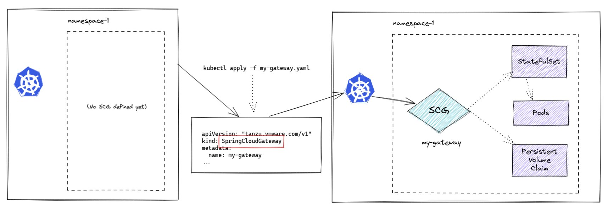

We start out with an empty namespace. We have not created anything in this namespace, and our goal for the first section is to create an instance of Spring Cloud Gateway. The way we will do this is by asking Kubernetes to do it for us by using the Kubernetes API, and the "Custom Resource Defitions" that have been added to the Kubernetes cluster when SCG4K8S was installed.


### Validate the Namespace is Empty

To start, there will be no springcloudgateways (scg), pods, or stateful sets in the session. Once we apply the Kubernetes manifest, the SCG4K8S operator will build one for us. That way the entire life cycle of the SCG instances will be manged for us!



No SpringCloudGateway, no pods, no persistent volume claims exist (yet).

```execute-1
kubectl get scg,statefulsets,pods,pvc
```

The above command should return no resources.

### Create a Gateway Service Instance

Inspect the demo/my-gateway.yaml file it contains the YAML shown below which defines a Spring Cloud Gateway instance.

>NOTE: This will open in the online editor that is part of this workshop.

```editor:open-file
file: ~/demo/my-gateway.yaml
```

Execute the below command which will submit a request to the cluster to deploy an instance of Spring Cloud Gateway.

```execute-1
kubectl apply -f demo/my-gateway.yaml 
```

>NOTE: It can take a few minutes for the gateway to initially come up.

You should see a pod of the spring cloud gateway running or being launched in the cluster's default namespace as shown in the output below. Now the namespace is no longer empty and has a few Kubernetes objects being created.

```execute-1
kubectl get scg,statefulsets,pods,pvc
```

>NOTE: Don't move on until the gateway is labeled true.

You can watch the logs or describe the various objects while you are waiting, example:

```execute-2
kubectl wait --for=condition=Ready --timeout=180s pod/my-gateway-0 && kubectl logs -f my-gateway-0
```

After a couple of minutes the logs should start displaying, and the SCG's status/Readiness should be True.

```
NAME                                             READY   REASON
springcloudgateway.tanzu.vmware.com/my-gateway   True    Created
```

The gateway is now running and available.

to stop following the logs.

```terminal:interrupt
session: 2
```

