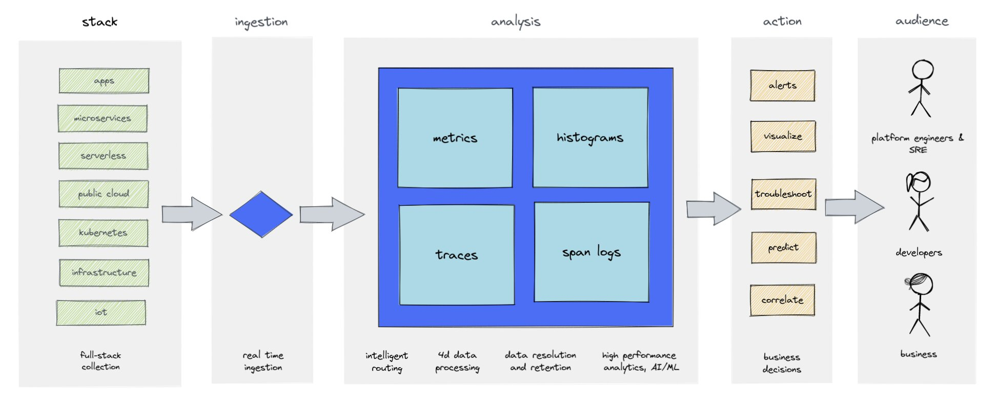

In this section we discuss Tanzu Observability and how the SCG can be configured to send metrics to it.

### Configure the Gateway for Tanzu Observability

Open a new file in the editor and replace the text with the configuration the person leading the workshop has provided.

The below manifest will create a secret that the SCG will use to send metrics to Tanzu Observability.

```editor:append-lines-to-file
file: ~/demo/wavefront-secret.yaml
text: |
    apiVersion: v1
    kind: Secret
    metadata:
        name: metrics-wavefront-secret
    data:
        wavefront.api-token: <replace with base64 encoded token>
        wavefront.uri: <replace with base64 encoded URL, e.g. https://vmware.wavefront.com>
```

Create that secret.

```terminal:execute
command: kubectl create -f ~/demo/wavefront-secret.yaml
```

Validate that secret.

```terminal:execute
command: kubectl get secret metrics-wavefront-secret -oyaml
```

Now add the observability configuration to the gateway definition.

Here we enable observability in the SCG, and as well configure it specifically for Tanzu Observability.

>NOTE: We are specifically setting the source below as the name of the session namespace.

```editor:append-lines-to-file
file: ~/demo/my-gateway.yaml
text: |2
    observability:
        metrics:
            wavefront:
                enabled: true
        wavefront:
            secret: metrics-wavefront-secret
            source: {{ session_namespace }}
```

>NOTE: We are recreating the gateway. It will take a few minutes to redeploy.

```terminal:execute
command: kubectl delete scg my-gateway && kubectl create -f ~/demo/my-gateway.yaml
```

Use the session namespace to find the source in Tanzu Observability.

```terminal:execute
command: echo $SESSION_NAMESPACE
```