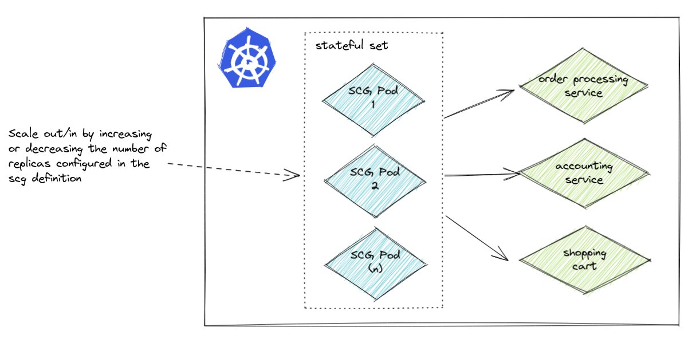

Depending on the amount and type of traffic that the SCG instance receives, or if we want to make it "highly available" we can either:

* Scale out / Horizontal scaling: Add more replicas (ie. pods) to the SCG instance, spreading the workload over those additional pods
* Scale up / Vertical scaling: Add more memory and CPU to the existing replicas

### Scale Out / Horizontal Scaling

In this section we'll add a second pod that makes up the SCG service.




#### Add More Replicas

First, let's review the gateway manifest.

```execute-1
kubectl get scg my-gateway -oyaml
```

And how many pods.

```execute-1
kubectl get pods
```

Which is based on the stateful set. Note the number of replicas.

```execute-1
kubectl get statefulsets.apps my-gateway -oyaml
```

Look for the "status" section near the bottom, specifically the number of replicas. Below the number of replicas in the StatefulSet is "1".

```
SNIP!
  status:
    availableReplicas: 1
    collisionCount: 0
    currentReplicas: 1
    currentRevision: my-gateway-5569f559fb
    observedGeneration: 1
    readyReplicas: 1
    replicas: 1
    updateRevision: my-gateway-5569f559fb
    updatedReplicas: 1
kind: List
metadata:
  resourceVersion: ""
  selfLink: ""
```

Now we can scale the instance out.

```execute-1
kubectl scale scg my-gateway --replicas=2 
```

Check the replicas again, note that it is now "2".

```execute-1
kubectl get statefulsets.apps my-gateway -oyaml
```

Example output:

```
SNIP!
status:
  availableReplicas: 1
  collisionCount: 0
  currentReplicas: 2
  currentRevision: my-gateway-5569f559fb
  observedGeneration: 2
  readyReplicas: 1
  replicas: 2
  updateRevision: my-gateway-5569f559fb
  updatedReplicas: 2
```

A second pod will come up. Of course we could do more than two for higher availability, but let's start with scaling up to two.

Get the pods again, and there show now be two pods.

```execute-1
kubectl get pods
```

At this point we have two pods running that make up the SCG instance and requests will be load balanced between them.

#### Scale In

Now, scale back in to one.

```execute-1
kubectl scale scg my-gateway --replicas=1
```

Now there will be a single pod again.

```execute-1
kubectl get pods
```

## Scale Up / Vertical Scaling

Not only can we scale out/horizontally by adding more pods, but we can also scale up the resources available to individual pods, ie. "scale vertically" by adding CPU and/or memory.

By default, the pods will have Kubernetes request and limits of the below.

|        | Request | Limit |
|--------|---------|-------|
| Memory | 256Mi   | 512Mi |
| CPU    | 500m    | 2     |

Let's validate those settings now.

>NOTE: Look for the requests and limits memory and CPU settings.

```execute-1
kubectl describe pod my-gateway-0 | grep Limits -A 5
```

Example output is below. Note that the cpu and memory limits and requests are 2,1 and 2Gi,1Gi respectively.

```
    Limits:
      cpu:     2
      memory:  2Gi
    Requests:
      cpu:      1
      memory:   1Gi
```

We can update the configuration. Here we are altering the memory and CPU requests.

>NOTE: If you look closely, we're actually "scaling down" the memory resources, as this is a workshop with limited resources instead of scaling up we'll scale down.

```editor:append-lines-to-file
file: ~/demo/my-gateway.yaml
text: |
    spec:
      resources:
        requests:
          memory: "512Mi"
          cpu: "1"
        limits:
          memory: "1Gi"
          cpu: "2"
```

Apply that manifest.

>NOTE: The pod will restart!

```execute-1
kubectl apply -f ~/demo/my-gateway.yaml
```

Now we'll have a new pod with a new request limit.

>NOTE: Again, look for the resources.requests memory and CPU settings.

```execute-1
kubectl describe pod my-gateway-0 | grep Limits -A 5
```

Should be 512Mi set for memory now.