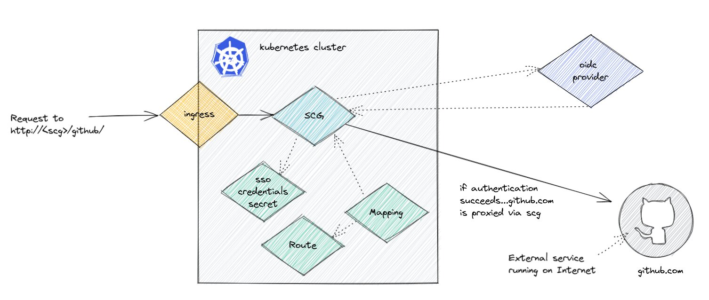

First, we'll create a file that contains the variables necessary to setup single sign on.

>NOTE: The instructor will provide the information required to fill out the variables in this file.

```editor:append-lines-to-file
file: ~/demo/sso-credentials.txt
text: |
    scope=openid,profile,email
    client-id={your_client_id}
    client-secret={your_client_secret}
    issuer-uri={your-issuer-uri}
```

Enter into that file the information your instructure has provided to access an instance of Okta.

```terminal:execute
command: cd; kubectl create secret generic my-sso-credentials --from-env-file=./demo/sso-credentials.txt
```

Validate that secret.

```terminal:execute
command: kubectl describe secret my-sso-credentials
```

Now we set the sso secret in the my-gateway defintion.

```editor:append-lines-to-file
file: ~/demo/my-gateway.yaml
text: |
        sso:
            secret: my-sso-credentials
```

Apply that new configuration.

```terminal:execute
command: kubectl apply -f ~/demo/my-gateway.yaml
```

As well, apply the new SSO route.

```terminal:execute
command: kubectl apply -f ~/demo/sso-route.yaml
```

Open the route in the browser. The instructor will provide a username and password for the Okta login.

>NOTE: This will require you login via Okta, and will "proxy" github through the Spring Cloud Gateway once authenticated.

Now, open the URL into your browser yourself.

http://{{ session_namespace}}-ingress.{{ ingress_domain }}/github/spring-cloud/spring-cloud-gateway
