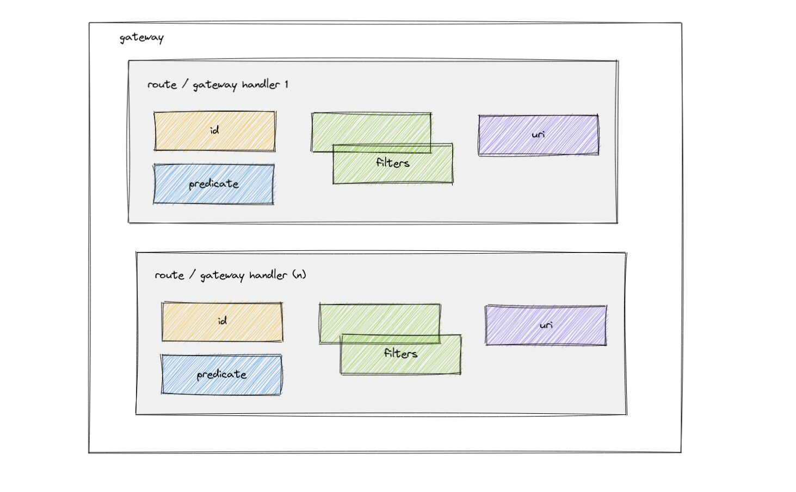

SCG has a feature called [routes](https://cloud.spring.io/spring-cloud-gateway/reference/html/#gateway-request-predicates-factories) which through configuration of predicates, filters, and URI manage requests and responses that traverse the gateway.

Examples of ways to implement route predicates:

* After (time)
* Before (time)
* Between (time)
* Cookie 
* Header 
* Host 
* Method 
* Path 
* Query 
* RemoteAddr 
* Weight

These routes allow us to manage the traffic going to the various APIs managed by the SCG via these major building blocks.

>Route: The basic building block of the gateway. It is defined by an ID, a destination URI, a collection of predicates, and a collection of filters. A route is matched if the aggregate predicate is true.

>Predicate: This is a Java 8 Function Predicate. The input type is a Spring Framework ServerWebExchange. This lets you match on anything from the HTTP request, such as headers or parameters.

>Filter: These are instances of GatewayFilter that have been constructed with a specific factory. Here, you can modify requests and responses before or after sending the downstream request.

