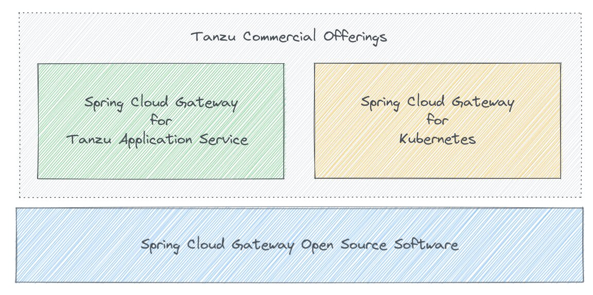

Spring Cloud Gateway OSS is a library that application developers can use to create *their own* API gateway solution. They'll have to add in all the other pieces needed to operationalize an API gateway in order to put it into production. Plus they'll have to maintain this solution over time, as well as manage it's lifecycle.

### Spring Cloud Gateway Commercial

The commerical version of SCG includes the ability to deploy to the Tanzu Application Service or Kubernetes, and is based on the OSS version but adds commercial features and platform support.

### Examples of Features the SCG Commercial Provides

* Kubernetes operator with custom resource definitions (CRDs)
* Commercial API route filters for SSO authentication, role-based access control, scopes authorization, authorized token relay, client certificate authorization, rate limiting and circuit breaker
* Dynamic API route configuration, enabling API route updates for CI/CD pipelines
* Simple Single Sign-On (SSO) configuration combined with commercial API route filters
* OpenAPI version 3 auto-generated documentation
* High availability configuration by setting instance count for horizontal scalability
* Vertical scaling configuration for memory and vCPU of API gateway instances
* Commercial container images to manage, create and dynamically update API routes on instances
* Access to configure JVM performance optimizations for API gateway instance specific use cases
* The ability to add custom extensions (Spring Cloud Gateway filters and predicates) so customers can provide a solution for their project specific API requirements
* API Gateway monitoring integrations for either Tanzu Observability (“Wavefront”) or Prometheus + Grafana including separate configurations for traceability and metrics
