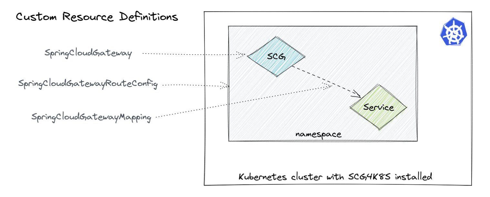
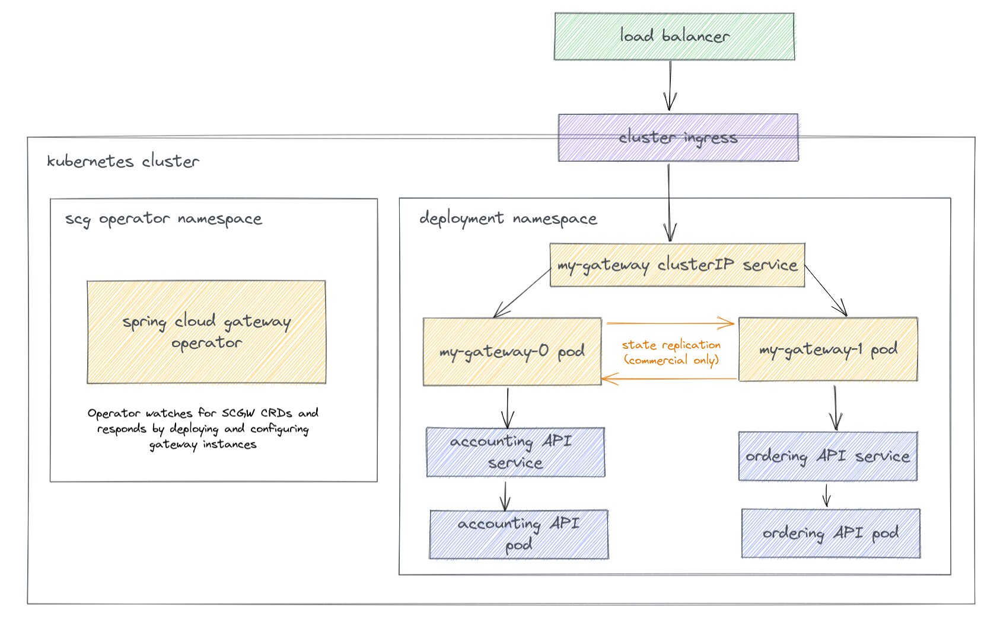

With Spring Cloud Gateway for Kubernetes (SCGK), the capabilities of Spring Cloud Gateway become part of the Kubernetes API. 

The open source Spring Cloud Gateway project does not provide a Kubernetes Operator, Kubernetes Custom Resources, etc, instead Spring Cloud Gateway for Kubernetes (SCGK) is a **commercial product** available from [VMware Tanzu](https://docs.vmware.com/en/VMware-Spring-Cloud-Gateway-for-Kubernetes/index.html). SCGK makes SCG Kubernetes native...it becomes part of the Kubernetes API and we can then configure SCG instances and their functionality just like any other Kubernetes object.

>Spring Cloud Gateway for Kubernetes, based on the open source Spring Cloud Gateway project, is the API gateway solution that application developers love. Spring Cloud Gateway for Kubernetes handles cross-cutting concerns on behalf of API development teams, such as: Single Sign-On (SSO), access control, rate limiting, resiliency, security, and more. Accelerate API delivery using modern cloud native patterns, any programming language you choose for API development, and integration with your existing CI/CD pipeline strategy. - [Spring Cloud Gateway for Kubernetes Documentation](https://docs.vmware.com/en/VMware-Spring-Cloud-Gateway-for-Kubernetes/index.html)
