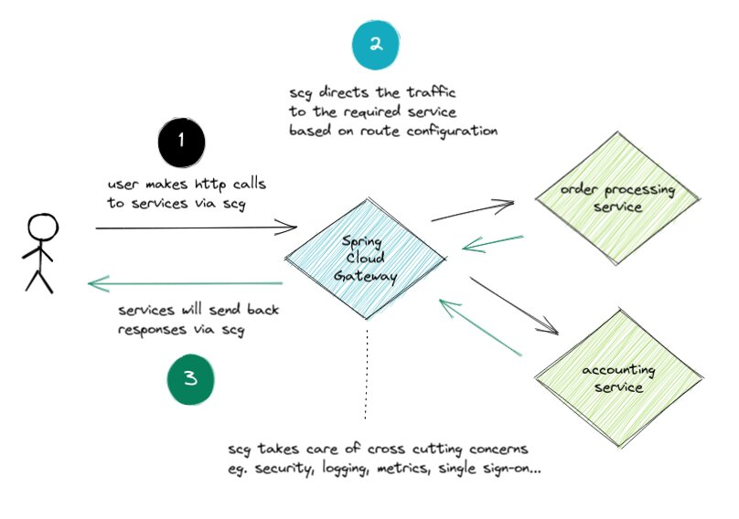
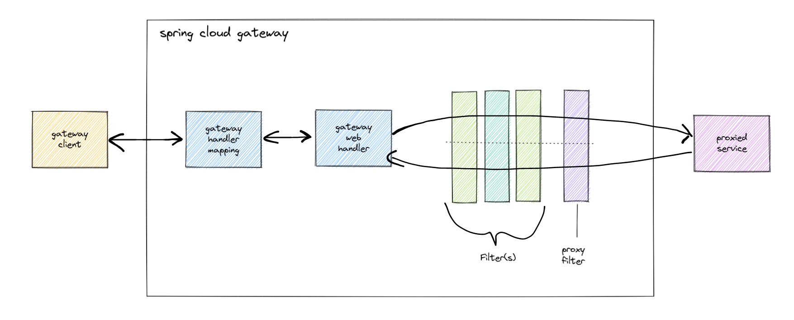

Spring Cloud Gateway (SCG) is:

>...an API Gateway built on top of the Spring Ecosystem...Spring Cloud Gateway aims to provide a simple, yet effective way to route to APIs and provide cross cutting concerns to them such as: security, monitoring/metrics, and resiliency. - [Spring Cloud Gateway Reference](https://cloud.spring.io/spring-cloud-gateway/reference/html/)

It's an open source project which you can use to build your own API gateway. SCG is used by thousands of development teams to handle their **production** API traffic. Built from the ground up for performance based on its non-blocking I/O design, it can handle load with low latency.

### How it Works

> Clients make requests to Spring Cloud Gateway. If the Gateway Handler Mapping determines that a request matches a route, it is sent to the Gateway Web Handler. This handler runs the request through a filter chain that is specific to the request. The reason the filters are divided by the dotted line is that filters can run logic both before and after the proxy request is sent. All “pre” filter logic is executed. Then the proxy request is made. After the proxy request is made, the “post” filter logic is run. - [SCG OSS Docs](https://docs.spring.io/spring-cloud-gateway/docs/current/reference/html/#gateway-how-it-works)
